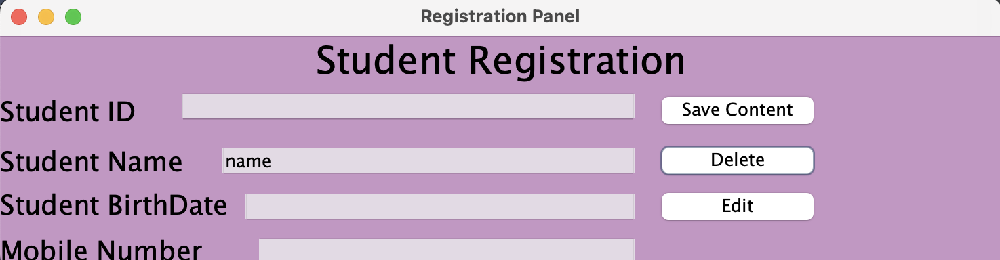

# School Registration System



## Project Overview

This project is a simple school registration system developed using Java and MySQL, managed through phpMyAdmin. The application allows users to add, update, and delete student records. Student data is stored in a MySQL database, enabling users to manage these records efficiently.

## Features

- **Add Student**: Insert new student records into the database.
- **Update Student**: Update existing student records. You can update student details by using the student's name.
- **Delete Student**: Delete student records. The record will be deleted based on the student's name.

## Requirements

- **Java Development Kit (JDK)**: Version 8 or above
- **MySQL**: Database management system
- **Open phpMyAdmin** (usually accessible via http://localhost/phpmyadmin).

## Installation

1. **Install Java JDK**:
    - [Download Java JDK](https://www.oracle.com/java/technologies/javase-jdk11-downloads.html)

2. **Install MySQL**:
    - [Download MySQL](https://dev.mysql.com/downloads/)

3. **Create the Database**:
    - Use the following SQL commands to set up the database:
      ```sql
      CREATE DATABASE School_Registration;
      USE School_Registration;
 
      CREATE TABLE Student (
          student_id INT AUTO_INCREMENT PRIMARY KEY,
          student_name VARCHAR(100),
          birth_date_std DATE,
          mobile VARCHAR(15)
      );
      ```

5. **Set Up Your Java Project**:
    - Open the project in your Java IDE (IntelliJ IDEA, Eclipse, etc.).
    - Add the `mysql-connector-java-<version>.jar` file to your project's libraries.

6. **Configure Database Connection**:
    - Update the `DriverManager.getConnection` method with the correct URL, username, and password.

## Usage

1. **Start the Application**:
    - Run the project in your IDE.

2. **Add a Student**:
    - Enter the student's name, birth date, and mobile number, then add the record.

3. **Update a Student**:
    - Enter the name of the student you wish to update and provide the new details.

4. **Delete a Student**:
    - Enter the name of the student you wish to delete and perform the deletion.

## Troubleshooting and Debugging

- If you encounter connection issues, ensure that your MySQL service is running and that you are using the correct connection settings.
- Verify that the JDBC driver is correctly added to your project.

## License

This project belongs to Şevval Ateş.
